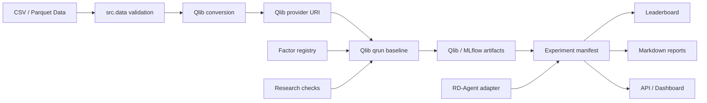

# Quant Alpha Factory


Author: Rishabh Patil

Quant Alpha Factory is a production-style quantitative research platform built around Microsoft
Qlib and Microsoft RD-Agent workflows. It is designed to show the engineering discipline behind
credible alpha research: data validation, reproducible experiments, leakage controls, cost-aware
portfolio analysis, controlled agent integration, and artifact-backed reporting.

This is not a notebook backtest. It is a tested research platform skeleton that can run without
live market data or LLM credentials, while still supporting real Qlib execution and opt-in
RD-Agent workflows when users provide their own environment and keys.

For the detailed live-integration setup path, see [docs/real_execution.md](docs/real_execution.md).

## What This Demonstrates

- Production-grade Python package structure with typed, composable modules.
- Validated CSV/Parquet ingestion for daily OHLCV data.
- Qlib-compatible data conversion with a native file-storage fallback for current `pyqlib`.
- Real Qlib baseline workflow execution through controlled `qrun` wrappers.
- RD-Agent command wrappers for `health_check`, `fin_factor`, `fin_model`, `fin_quant`,
  `fin_factor_report`, and `ui`.
- Experiment manifests with config hashes, data hashes, git commit when available, date splits,
  costs, metrics, artifact paths, command lineage, status, and failure reason.
- Research controls for date splits, fit/test overlap, leakage patterns, and missing transaction
  cost assumptions.
- Factor registry with economic rationale, leakage notes, Qlib expressions, and IC/rank IC helpers.
- Cost-aware portfolio metrics, turnover, drawdown, benchmark metadata, and Markdown tearsheets.
- Optional FastAPI and Streamlit readers over stored artifacts.
- Docker, Compose, GitHub Actions CI, and Makefile targets for repeatable local workflows.

No live tradable performance is claimed. Bundled metrics and demo outputs use deterministic
synthetic data and exist to validate the workflow.

## Why This Matters

Quant research infrastructure fails when results are not reproducible, data quality assumptions are
implicit, leakage checks are missing, or backtests are ranked by gross returns alone. This project
focuses on those controls first. It is built to communicate that alpha research should be:

- reproducible from manifests,
- validated before modeling,
- separated into train, validation, and test periods,
- evaluated after costs,
- reviewed before agent-generated ideas are promoted,
- reported from artifacts rather than memory or screenshots.

## Getting Started

The no-secret path works with synthetic data and does not require Qlib datasets, live market data,
RD-Agent credentials, or internet-dependent tests.

```bash
python -m venv .venv
source .venv/bin/activate
make install
make quickstart
```

`make quickstart` runs lint, tests, CLI status, sample data validation, research checks, Qlib demo
dry-run, RD-Agent dry-run commands, and the deterministic synthetic demo.

After installation, the console script is also available:

```bash
qaf status
qaf doctor --component all --allow-missing-llm --skip-docker-daemon
qaf demo synthetic
qaf qlib demo --dry-run
```

Before publishing or handing off the repo, run:

```bash
make validate-release
```

## One-Command Qlib Synthetic Demo

Real Qlib execution is opt-in. The local validation path has been tested with Python 3.11,
`pyqlib`, LightGBM, synthetic Qlib file storage, and Qlib/MLflow artifacts.

```bash
make install-real
make qlib-demo-real
```

Equivalent explicit commands:

```bash
python -m src.cli doctor --component qlib --strict
python -m src.cli qlib demo --execute
```

The Qlib demo validates `data/sample/prices.csv`, converts it into Qlib-compatible storage, runs
research checks, executes `qrun`, parses Qlib/MLflow metrics, and writes a project manifest under
`artifacts/experiments/<experiment-id>/manifest.json`.

Metrics from this command are synthetic workflow-validation metrics, not live-market claims.

## RD-Agent Readiness

RD-Agent real workflows require user-provided LLM credentials. Users can still verify installation
and Docker readiness without secrets:

```bash
DS_CODER_COSTEER_ENV_TYPE=docker \
  python -m src.cli doctor --component rdagent --allow-missing-llm --strict
```

Dry-run commands do not call an LLM:

```bash
python -m src.cli rdagent health --dry-run
python -m src.cli rdagent run --mode fin_factor --loop-n 1 --dry-run
```

Real agent execution remains explicit:

```bash
python -m src.cli rdagent run --mode fin_factor --loop-n 1 --execute
```

Generated hypotheses are not promoted automatically. The repository includes a human review layer
for rationale, risk notes, reviewer decision, and promotion status.

## Core Commands

```bash
make install
make quickstart
make validate-release
make install-real
make qlib-demo-real
make docker-build
make docker-test
```

```bash
python -m src.cli data validate --input data/sample/prices.csv
python -m src.cli data convert --input data/sample/prices.csv --output data/qlib_bin/sample --dry-run
python -m src.cli research check --config configs/qlib/baseline_lightgbm_alpha158.yaml
python -m src.cli qlib demo --dry-run
python -m src.cli experiments list
python -m src.cli experiments leaderboard --metric net_return
python -m src.cli report build --experiment-id synthetic-demo
```

## Feature Map

| Area | What is implemented |
| --- | --- |
| Data | CSV/Parquet loading, schema normalization, OHLCV validation, duplicate/date checks |
| Qlib | Conversion, native file storage fallback, qrun wrapper, real synthetic demo, metric parsing |
| RD-Agent | Safe command construction, dry-run/execute manager, logs, manifests, human review |
| Experiments | JSON manifests, hashes, artifacts, failure recording, leaderboard |
| Validation | Split checks, leakage heuristics, fit/test overlap checks, cost assumption checks |
| Factors | Versioned registry, baseline factor families, IC/rank IC evaluation |
| Portfolio | Top-K, turnover constraint, cost adjustment, drawdown, Sharpe/IR, tearsheets |
| Reporting | Markdown reports from manifests, explicit missing-metric handling |
| Interfaces | Typer CLI, optional FastAPI, optional Streamlit dashboard |
| MLOps | Makefile, Dockerfile, Compose, GitHub Actions, no-secret CI |

## Architecture



Qlib and RD-Agent are integration targets, not hidden global dependencies. CI and local tests use
synthetic data and mocked/dry-run execution paths.

## Validation Status

Latest local validation:

```text
ruff: All checks passed
pytest: 160 passed
make quickstart: passed with Python 3.11
```

The suite covers data validation, Qlib command construction and demo orchestration, Qlib config
checks, RD-Agent command construction, no-LLM readiness checks, failed-run manifests, leakage checks,
factor registry behavior, experiment manifests, leaderboard sorting, reporting, API/dashboard
readers, Docker/CI contract files, and the synthetic end-to-end demo.

## What Is Real, Dry-Run, And Synthetic

Real and validated locally:

- Python 3.11 project environment.
- Qlib installation and `qrun` execution on deterministic synthetic data.
- Qlib/MLflow artifact parsing into project manifests.
- RD-Agent package installation and Docker readiness checks without LLM keys.

Dry-run by default:

- Qlib conversion and qrun commands.
- RD-Agent health and finance workflow commands.
- API/dashboard serving commands.

Synthetic:

- `data/sample/prices.csv`.
- `python -m src.cli demo synthetic`.
- `python -m src.cli qlib demo --execute`.
- Any bundled demo metrics or generated reports.

Requires user setup:

- Real market research requires licensed or user-provided market data.
- Real RD-Agent workflows require user-provided LLM provider credentials.
- Docker must be running for RD-Agent isolated execution.

## Configuration

Important files:

```text
configs/qlib/baseline_lightgbm_alpha158.yaml
configs/qlib/conversion_sample.yaml
.env.example
pyproject.toml
Makefile
```

Environment variables for RD-Agent are documented in `.env.example` and
`docs/real_execution.md`. Do not commit `.env`.

## API And Dashboard

The optional API and dashboard read stored experiment manifests and leaderboard rows. They do not
recompute experiments by default.

```bash
python -m src.cli api serve --dry-run
python -m src.cli dashboard run --dry-run
```

Install optional dependencies with:

```bash
python -m pip install -e ".[api,dashboard]"
```

## Docker

```bash
docker build -t quant-alpha-factory:local .
docker run --rm quant-alpha-factory:local python -m pytest
docker compose run --rm quant-alpha-factory python -m src.cli --help
```

The default Docker image installs developer, API, and dashboard dependencies. Real Qlib and
RD-Agent dependencies remain opt-in to keep the default image practical.

## Limitations

- Synthetic metrics are not investment claims.
- No licensed market dataset is bundled.
- RD-Agent live execution is intentionally gated behind user credentials.
- The dashboard is intentionally lightweight and reads stored artifacts only.
- The transaction cost model is simple and should be expanded for venue-specific assumptions.
- Qlib/MLflow artifact parsing is conservative and should be extended as more real recorder outputs
  are observed.

## Documentation

- [Architecture](docs/architecture.md)
- [Methodology](docs/methodology.md)
- [Leakage Policy](docs/leakage_policy.md)
- [Real Execution Guide](docs/real_execution.md)
- [Recruiter Summary](docs/recruiter_summary.md)
- [Research Memo Template](docs/research_memo_template.md)
- [Project Walkthrough](docs/project_walkthrough.md)
- [Limitations](docs/limitations.md)

## Suggested Review Path

For a quick technical review:

```bash
make install
make quickstart
python -m src.cli experiments leaderboard --metric net_return
python -m src.cli report build --experiment-id synthetic-demo
```

For Qlib integration review:

```bash
make install-real
make qlib-demo-real
```

For RD-Agent integration review without keys:

```bash
DS_CODER_COSTEER_ENV_TYPE=docker \
  python -m src.cli doctor --component rdagent --allow-missing-llm --strict
```
